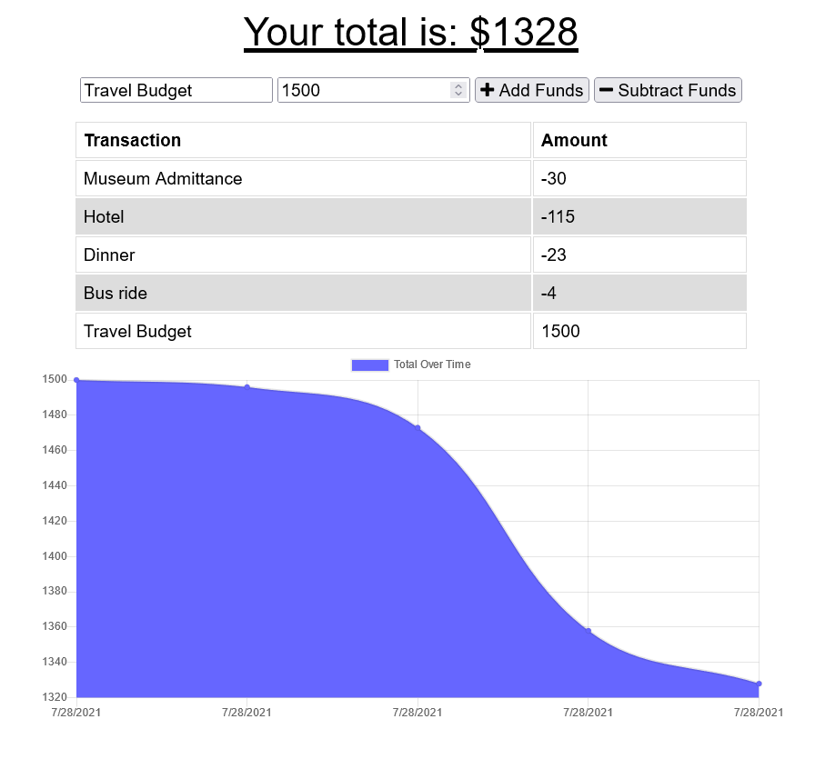

# PWA-Budget
## A bugeting app using Progressive Web App principles.

## Description:
A simple budgeting app for use in cases of unrealiable data connections. The user can add or subtract from their balance and see their total balance. Transactions made while offline are cached using IndexedDB and uploaded to the database the next time the app has a connection.

## Table of Contents:
[User Story](#User-Story) 
[Usage](#Usage) 
[Tests](#Tests) 
[Contributions](#Contributions) 
[Contact](#Contact) 
[License](#License) 

## User Story:
- AS AN avid traveller
- I WANT to be able to track my withdrawals and deposits with or without a data/internet connection
- SO THAT my account balance is accurate when I am traveling

## Usage:
Application preview: 
 

## Tests:
No tests are currently included.

## Contributions:
Technologies used include JavaScript, Node.js, MongoDB, and IndexedDB.

## Contact:
Check out my [Github](https://github.com/MonsAltus). 
Email me at <hacklander.dev@gmail.com>

## License:
Covered under the [MIT License](https://github.com/MonsAltus//PWA-Budget/blob/main/LICENSE).
